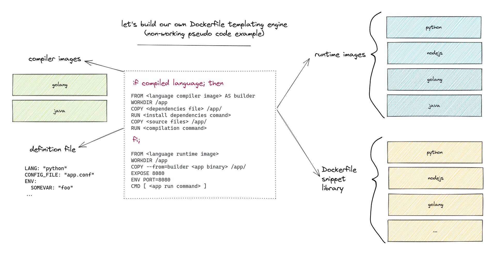

At this point we've got a few Dockerfiles, and are supporting four languages, Java, Python, Golang, and NodeJS. 

However, managing each individual Dockerfile as it's own separate, individual "thing" is not going to scale well. That much is obvious. Right around here many organizations will start wondering about how to abstract or template the Dockerfiles. It seems a reasonable idea.

When we look at the overly simple Dockerfiles we have right now, there seem to be three our four main sections.

1. Compiling, perhaps in a multi-stage Dockerfile
2. Ensuring the right dependencies are installed
2. Copying in the application binary or files
2. Copying in the configuration files, if any
2. Exposing a port
2. Setting environment variables
2. Running the application
2. etc...

There's not much going on so far, so perhaps we could actually write our own templating engine, perhaps implement it in Python or some language with a good templating libary.

### Dockerfile as a Programming Language?

If we do build our own templating application, library of Dockerfile snippets, and configuration file, then we are stuck forever maintaining that. Docker has even considered, and rejected, the idea of an [IMPORT command](https://github.com/moby/moby/issues/735), which would seemingly make sense from our current perspective.

However, I'd like to highlight one comment from the above link:

>I completely get the use cases for an include statement. But then I also get the need for parametrized Dockerfiles, and then for conditionals, etc. Continue down that path, and you'll end up implementing a programming language in Dockerfiles, which may even become turing complete.

It doesn't seem like Docker has, so far, officially commented on the idea of turning a Dockerfile into a programming language, but you could see how that idea might be something we'd want to avoid. Dockerfiles are relatively simple now, powerful (maybe overly so), but simple, a bunch of stacked commands.

All that said, if we have to build our own "smart preprocessor" to deal with the linear growth of Dockerfiles, are we in a better state? Likely not. Honestly, at this point we have to wonder if Dockerfiles are the *right* way to build container images, especially in situations where there is the potential for *many* Dockerfiles.