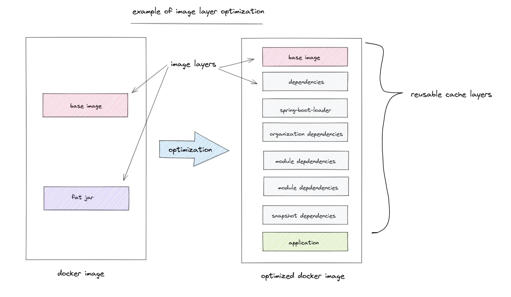

A key part of using container images is the idea of layers. But how many layers should a container image have? From our image above, for most of this workshop we've used a base image and a fat jar file, so we only have a few layers, mostly around updating the base image, installing some dependencies, and runnign a jar file. That's about it.

From here, it seems like on one hand a few simplistic layers isn't enough, but then how many should we have. The above image has an "optimized" image with many more layers, but the point of this section isn't what layers *should* be there, but how much should we optimize the image? What is the correct number of layers for a particular Java application? It's hard to say, and while there is likely a common answer, it would take an organziation a long time to get there.

```editor:select-matching-text
file: ~/demo/19.Dockerfile
text: "COPY --from=builder /app/dependencies/ ./"
after: 3
```

Build the example optimized image.

```terminal:execute
command: cd ~/demo; time docker build -f 19.Dockerfile . -t helloworld:19
```

It's possible to take this even farther, as the default number of layers created by Spring Boot is four:

* dependencies: dependency without SNAPSHOT version
* spring-boot-loader: JAR loader classes
* snapshot-dependencies: any dependency with SNAPSHOT version
* application: application classes and resources

Adding more layers means enabling layers in the POM file.

```
<build>
    <plugins>
        <plugin>
        <groupId>org.springframework.boot</groupId>
        <artifactId>spring-boot-maven-plugin</artifactId>
        <configuration>
            <layers>
                <enabled>true</enabled>
            </layers>
        </configuration> 
        </plugin>
    </plugins>
</build>
```

But, again, how many layers? Who keeps track of this?

### Thanks

This section was based on this [post](https://redamessoudi.com/optimized-docker-images-for-spring-boot-apps/) by Reda Messoudi.
