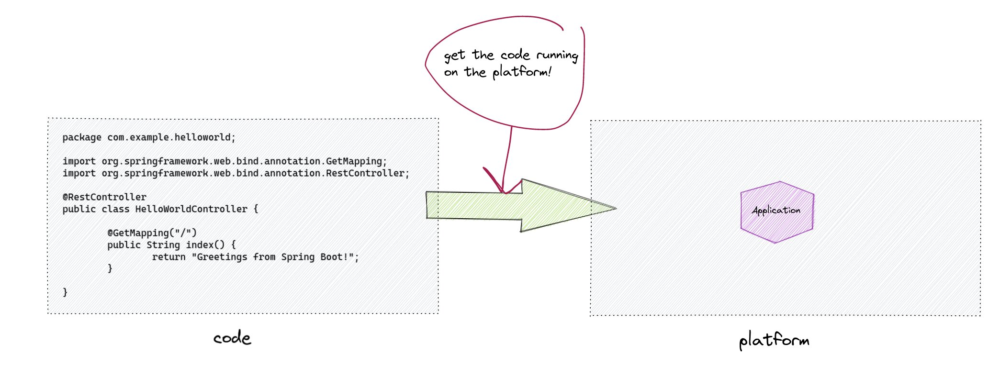

Now that we have gone through all these steps, we might be thinking "is there a better way?" and do organiztions really have to implement all of this on their own just to deploy some containerized applications?

Well, the answer is no, you don't. One of the key things to remember is that we don't actually need Dockerfiles to build a container image. A container image is based on a specification and that specification is free to be implemented in many ways. Certainly Dockerfiles are the most common, but there are other ways.

Another way is via Spring Boot, which uses [buildpacks](https://buildpacks.io) underneath the hood.

Here's a command to build the image using Spring Boot.

```terminal:execute
command: cd ~/demo/helloworld; time ./mvnw spring-boot:build-image
```

Now we have an image named and tagged as below.

```
[~/demo/helloworld] $ docker images helloworld:0.0.1-SNAPSHOT
REPOSITORY   TAG              IMAGE ID       CREATED        SIZE
helloworld   0.0.1-SNAPSHOT   6bcfb1cc6cc8   42 years ago   261MB
```

```terminal:execute
command: docker images helloworld:0.0.1-SNAPSHOT
```

### Buildpacks

[Buildpacks](https://buildpacks.io) are another way of creating container images. Buildpacks have many powerful features, but more mportant, is that container images are built without the need to use or manage Dockerfiles. So all of this previous work we've done exporing, using, fiddling with, templating, Dockerfiles simply goes away. Instead we just use buildpacks, like a well-governed official image for almost any language.

>If you’ve ever used an application platform such as Cloud Foundry or Heroku then you’ve probably used a buildpack, perhaps without even realizing it! Buildpacks are the part of the platform that takes your application and converts it into something that the platform can actually run. For example, Cloud Foundry’s Java buildpack will notice that you’re pushing a .jar file and automatically add a relevant JRE.
>Until relatively recently buildpacks were tightly coupled to the platform and you couldn’t easily use them independently. Thankfully they’ve now broken free, and with Cloud Native Buildpacks you can use them to create Docker compatible images that you can run anywhere. - [spring.io](https://spring.io/blog/2020/01/27/creating-docker-images-with-spring-boot-2-3-0-m1)

Under the hood, the "spring-boot:build-image" command is using Buidpacks!
